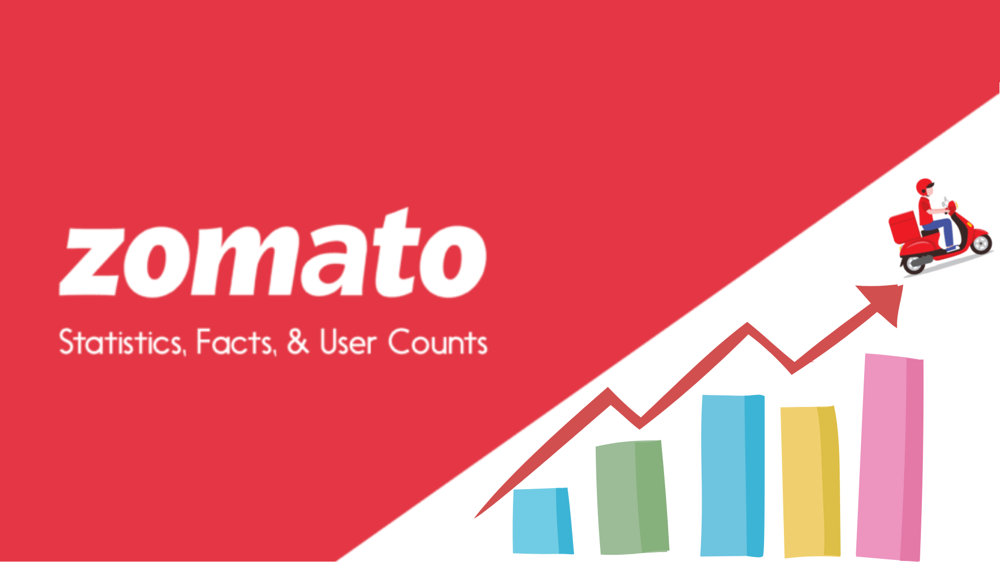

# Zomato Data Analysis


Welcome to the Zomato Data Analysis repository! This project explores the Zomato dataset to uncover insights about restaurants, cuisines, and customer ratings across various countries.

## Table of Contents

- [Introduction](#introduction)
- [Dataset](#dataset)
- [Installation](#installation)
- [Key Insights](#key-insights)
- [Contributing](#contributing)
- [License](#license)

## Introduction

This project analyzes the Zomato dataset to gain insights into customer preferences, popular cuisines, restaurant ratings, and more.

## Dataset

The dataset includes:
- Restaurant details (name, city, address, cuisines, etc.)
- Ratings and reviews
- Country information

## Key Insights

- **Country Distribution**: Most records are from India, followed by the USA and the UK.

- **Ratings**: Not Rated count is very high,The majority of ratings fall between 3.0 to 3.6.

- **Online Delivery**: Available mainly in India and the UAE.

- **Top Cities**: New Delhi, Gurgaon, and Noida.
  
     
- **Popular Cuisines**: North Indian is the most ordered cuisine.


## Installation

- Clone the repository:
   ```sh
   git clone https://github.com/sabeer-k-s/Zomato-Exploratory-Analysis.git
   ```

## Contributing

Contributions are welcome! Please submit a Pull Request.

## License

This project is licensed under the MIT License.

---

Explore the dataset and use this analysis as a starting point for further insights into Zomato data. Happy analyzing!
